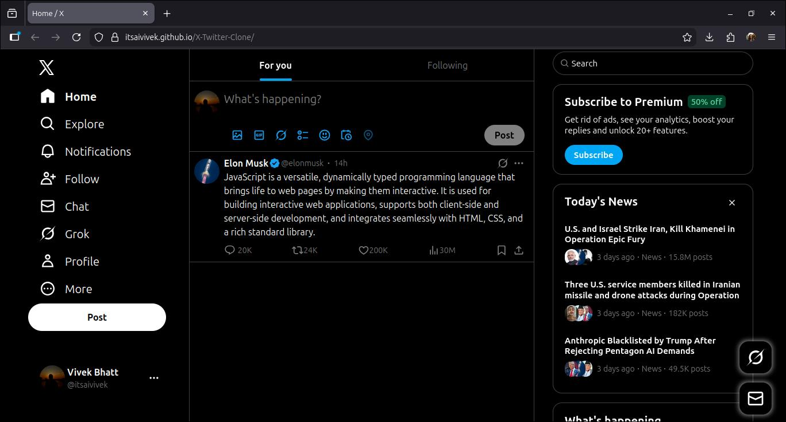

# X (Twitter) Clone



This is a simple clone of X (formerly Twitter) built using HTML, Tailwind CSS, and JavaScript. It mimics the basic layout and functionality of X's home page, including a sidebar for navigation, a middle feed for posts, a post composer, and a right panel for trends and news. The project is designed for beginners to understand web development basics like structuring a page with HTML, styling with CSS (via Tailwind), and adding interactivity with JavaScript.

The clone allows users to type and "post" messages, which appear dynamically in the feed. It uses fake data for posts, profiles, and trends. Note: This is a static frontend project—no real backend, database, or user authentication is involved. Features like notifications or real-time updates are simulated or not fully functional (they show a "feature not available" message).

## Features
- Responsive layout that adapts to different screen sizes (desktop, tablet, mobile).
- Post composer: Type a message and post it to the feed.
- Dynamic post addition: New posts appear below existing ones using JavaScript.
- Sidebar with navigation icons (Home, Explore, etc.).
- Right panel with premium subscription prompt, today's news, and trending topics.
- Floating buttons for quick actions (simulated).
- Basic hover effects and cursor interactions for better user experience.

## File Structure

```
X-TWITTER-CLONE/
├── img/                  # Folder for images like profile pictures
│   ├── profilepicture.jpg
│   ├── ElonMusk.jpg
│   ├── narendraModi.jpg
│   ├── balen.jpg
│   ├── sacar.jpg
│   ├── kp oli.jpg
│   ├── donaldTrump.jpeg
│   └── (other images)
├── js/                   # Folder for JavaScript files
│   └── script.js         # Main JS file for interactivity (posting, events)
├── node_modules/         # Node.js dependencies (installed via npm)
├── src/                  # Folder for CSS source files
│   ├── input.css         # Tailwind CSS input file with custom styles
│   └── output.css        # Compiled CSS output (generated by Tailwind)
├── svg/                  # Folder for SVG icons (e.g., home, explore, like)
│   ├── logo.svg
│   ├── home.svg
│   ├── explore.svg
│   ├── (other SVGs)
│   └── ...
├── user/                 # Folder for user-related data
│   └── userinfo.json     # JSON file with user info for posts
├── .gitignore            # Git ignore file
├── favicon.ico           # Favicon for the site
├── imp.txt               # Contains XML namespace
├── index.html            # Main HTML file for the page structure
├── LICENSE               # License file (e.g., MIT)
├── package-lock.json     # NPM lock file for dependencies
├── package.json          # NPM package file with scripts and dependencies
├── README.md             # This file (documentation)
```

## Prerequisites
- Basic knowledge of HTML, CSS, and JavaScript.
- Node.js and npm installed on your machine (for building Tailwind CSS).

## Installation and Setup
To run this project locally or make changes:

1. **Clone the Repository**:
   - If you have a GitHub repo, clone it using:
     ```
     git clone https://github.com/itsaivivek/X-Twitter-Clone.git
     ```
   - Navigate into the project folder:
     ```
     cd x-twitter-clone
     ```

2. **Install Dependencies**:
   - Run this to install Tailwind CSS and other packages:
     ```
     npm install
     ```

3. **Build the CSS**:
   - The project uses Tailwind CSS, which needs to be compiled from `src/input.css` to `src/output.css`.
   - Run the build script (it watches for changes and rebuilds automatically):
     ```
     npm run build
     ```
     This uses the script in `package.json`: `"build": "npx @tailwindcss/cli -i ./src/input.css -o ./src/output.css --watch"`.
     - Keep this command running in your terminal while developing—it will auto-update `output.css` when you change `input.css`.

4. **Open the Project**:
   - Open `index.html` in your web browser (e.g., right-click and select "Open with Live Server" if using VS Code, or just double-click it).
   - The page should load with the X clone interface.

5. **Make Changes**:
   - Edit HTML in `index.html` for structure.
   - Edit styles in `src/input.css` (Tailwind classes or custom CSS).
   - Edit JavaScript in `js/script.js` for behavior.
   - Add or modify images/SVGs in `img/` or `svg/`.
   - Update user data in `user/userinfo.json`.
   - After changes, refresh your browser. CSS rebuilds automatically if `npm run build` is running.

## How It Works
I'll explain the code section by section in simple terms, focusing on what each part does and how it contributes to the overall app. This is beginner-friendly, with details on specific tasks.

### 1. **HTML Structure (`index.html`)**
   This file is the backbone of the page. It uses a grid layout to divide the screen into three columns: left sidebar (navigation), middle (feed and composer), and right (trends/news).

   - **Head Section**:
     - Sets the page title ("Home / X") and links to `src/output.css` for styles.
     - Uses meta tags for responsive design (e.g., viewport for mobile).

   - **Body and Main Layout**:
     - `<main>` uses Tailwind classes like `grid bg-black grid-cols-[24%_44%_32%]` to create a black background grid. It adjusts columns for smaller screens (e.g., hides right panel on mobile).
     - **Left Container (`<section class="leftContainer">`)**: 
       - Contains navigation buttons (Home, Explore, etc.) with icons from `svg/`.
       - Each button is a `<div>` with an icon and text. On click, JavaScript shows a "feature not available" message (simulated).
       - At the bottom, shows user profile with picture from `img/profilepicture.jpg`.
     - **Middle Container (`<section class="middleContainer">`)**:
       - Has a header with "For you" and "Following" tabs (clicking "Following" shows unavailable message).
       - **Post Composer**: A textarea for typing posts. It grows dynamically as you type (handled by JS). Icons for photos, GIFs, etc., are placeholders.
       - **Feed (`<div class="someonePost">`)**: Starts with a sample post from Elon Musk. New posts are added here via JS.
       - Each post has profile pic, name, text, and interaction buttons (reply, like, etc.) with fake counts.
     - **Right Container (`<section class="rightContainer">`)**:
       - Premium subscription box (clicking "Subscribe" shows unavailable).
       - "Today's News" section with fake headlines and viewed-by images.
       - "What's Happening" trends with hashtags.
       - Footer with links (Terms, Privacy, etc.).
     - **Fixed Buttons**: Floating icons for Grok and Chat (simulated, show unavailable on click).
     - **Unavailable Message**: A hidden div that appears briefly for unavailable features.

   - **Script Link**: At the end, loads `js/script.js` for interactivity.

### 2. **CSS Styling (`src/input.css` and `src/output.css`)**
   - **input.css**: This is where you write styles. It imports Tailwind, defines a custom teal filter for icons, and adds utilities like custom scrollbars.
     - Uses `@theme` for variables (e.g., custom teal filter).
     - `@layer utilities`: Defines classes like `.custom-scroll` for thin scrollbars.
     - Custom rules for elements: Inverts icon colors, sets widths/heights, adds hover effects (e.g., buttons darken on hover).
     - Responsive hiding: Uses `max-lg:hidden` to hide text on smaller screens.
   - **output.css**: This is auto-generated by Tailwind when you run `npm run build`. Don't edit it directly—change `input.css` instead. It compiles Tailwind classes into full CSS, including resets, themes, and utilities.

   **How CSS Works**:
   - Tailwind classes like `flex gap-4` make layouts flexible and spaced.
   - Hover effects: `hover:bg-neutral-900` changes background on mouse over.
   - Filters: `--filter-custom-teal` colors icons blue-green.
   - Responsiveness: Media queries (e.g., `max-lg:`) adjust for screen size.

### 3. **JavaScript Interactivity (`js/script.js`)**
   This file adds dynamic behavior. It uses async functions for loading data and event listeners for user actions.

   - **loadJSONData Function**: Fetches `user/userinfo.json` asynchronously. If there's an error, it logs it.
     - Used to get user details like name, handle, and profile pic for new posts.

   - **appendNewPost Function**: Creates a new post element and adds it to the feed.
     - Takes text from the textarea and user data from JSON.
     - Builds HTML for the post (profile, text, interactions) and appends it to `.someonePost`.
     - Increments post class (e.g., `post1`, `post2`) for uniqueness.

   - **Textarea Event Listeners**:
     - On click: Shows "who can reply" option.
     - On input: Dynamically resizes the textarea to fit text (sets height to `scrollHeight`).
     - Enables/disables the post button based on if text is entered (removes brightness filter).

   - **Post Button Click**:
     - Gets textarea value.
     - Loads user JSON.
     - Calls `appendNewPost` to add the new post to the feed.

   - **showUnavailableMessage Function**: Shows a brief message for unavailable features (fades out after 1 second).

   - **Event Listeners for Unavailable Features**:
     - Attaches to sidebar buttons, fixed buttons, "Following" tab, and subscribe button.
     - Calls `showUnavailableMessage` on click.

   **How JS Works**:
   - It's event-driven: Listens for user actions like typing or clicking.
   - Uses DOM manipulation (e.g., `createElement`, `appendChild`) to add content dynamically.
   - Async/await makes fetching JSON non-blocking.

### 4. **User Data (`user/userinfo.json`)**
   - A simple JSON file with user details: name, handle, uploaded time, interaction counts, and profile pic path.
   - Used by JS to populate new posts with consistent user info.

## Limitations
- No real posting or data storage—posts are added to the page but lost on refresh.
- Many features are simulated (e.g., no actual replies or searches).
- Static data: News and trends are hardcoded in HTML.

## Contributing
Feel free to fork the repo, make changes, and submit a pull request. For beginners: Start by adding new icons or changing colors in CSS.

## License
This project is licensed under the MIT License (see `LICENSE` file).